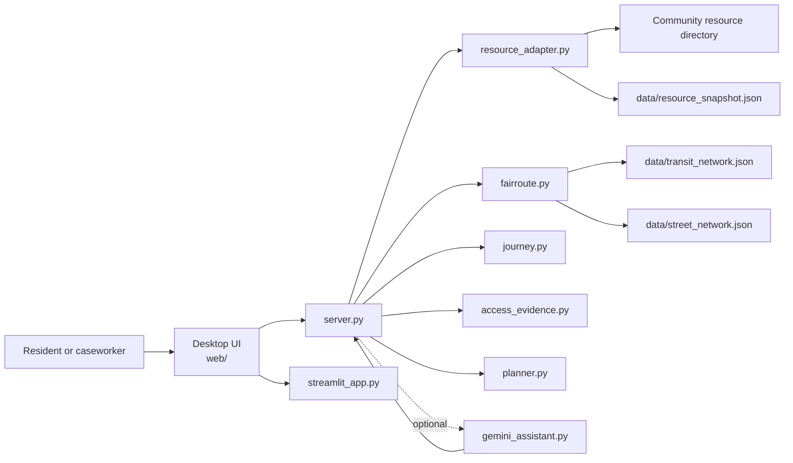

# Architecture

FairRoute separates deterministic application logic from the optional language-model interface. The core product remains usable without Gemini.

## System overview

## Responsibility boundaries

### Interface layer

`web/` contains the desktop HTML, CSS, and JavaScript interface. `server.py` exposes the local application endpoints used by that interface. `streamlit_app.py` bridges the same desktop experience into Streamlit hosting.

### Routing and journey logic

`fairroute.py` contains the street and transit models and produces inspectable travel options. `journey.py` handles ranking, category matching, itinerary presentation, and related journey helpers.

The important design constraint is that these calculations do not depend on language-model output.

### Resource data

`resource_adapter.py` reads the public resource source and combines it with curated local data. A checked-in resource snapshot provides fallback behavior when the live source is unavailable.

A user's precise origin is not required for the directory lookup itself.

### Accessibility evidence

`access_evidence.py` keeps structured access facts separate from route geometry. Missing information remains uncertain, and the application can surface questions a user may want to verify with a provider before traveling.

### Planning layer

`planner.py` evaluates synthetic sample locations and illustrative interventions. It supports both mean-access and fairness-aware objectives. These outputs describe the model, not measured population outcomes.

### Optional Gemini layer

`gemini_assistant.py` is a bounded natural-language interface. The model receives explicit user text and application context and can request only allowlisted FairRoute tools.

It cannot:

- execute shell commands,
- contact providers,
- write back to the resource directory,
- issue arbitrary application actions,
- or generate authoritative routing/accessibility numbers independently of the tool layer.

## Data flow for a resource search

1. The user chooses an origin, resource need, travel modes, and mobility/access constraints.
2. The server validates and bounds the request.
3. Resource candidates come from the live directory plus curated/fallback data.
4. The routing engine evaluates each candidate under the requested travel constraints.
5. Journey helpers rank the evaluated options.
6. Accessibility evidence is attached to the selected trip without converting unknown facts into verified facts.
7. The UI presents the route, burden, uncertainty, and practical verification questions.

## Trust model

FairRoute intentionally distinguishes three categories of information:

- **Computed:** travel and planning results produced by deterministic code from bundled/live inputs.
- **Reported:** directory, transit, or other source data that may become stale.
- **Unknown or illustrative:** information that must not be mistaken for verified real-world accessibility.

That distinction is central to the product design.
